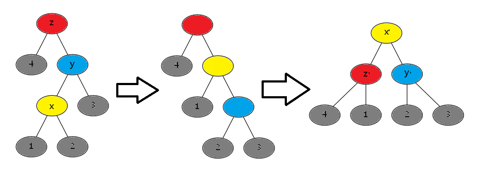

# 均摊分析

## 概念

均摊分析是一种分析算法复杂度的分析方法；通常用来计算一系列操作的复杂度上界。而均摊复杂度就是最坏情况下每次操作的平均时间耗费。

在计算有些算法或者数据结构的操作复杂度时，我们发现个别情况单次操作的时间可能比较高，而有些情况单次操作时间又非常低；在一个结构上连续执行若干操作，总的操作时间的平均值上界总是没有时间复杂度最高的操作那么高。

这时我们希望更进一步地找到一个紧的上界来描述这种结构的耗时。

## “非”常用

思考这样一个问题；

> 给一个空队列，可以执行两种操作：
>
> 1. 在队尾放入一个元素
> 2. 弹出任意多个元素

对于一次2操作，可能弹出很多个元素；如果之前放入了n个，这次就可能弹出n个元素。这就是我们说的“单次时间复杂度可能较高”。

但显然，弹出总个数不可能超过放入元素的次数，所以总时间复杂度是$O(n)$；均摊复杂度$O(1)$

---

>给一个二进制计数器，每次可以给计数器+1;
>
>每变动一位的0,1状态会耗费1的时间。

### 方法一

考虑每一位变动的次数：第i位每隔$2^i$次变动一次；那么总变动次数便是$\frac{n}{2^0}+\frac{n}{2^1}+\frac{n}{2^2}+\cdots+\frac{n}{2^{\log n}}=O(n)$

均摊复杂度$O(1)$

### 方法二

把0变成1看做投资2元，消耗1元；1变成0看做消耗1元；

金库永远不可能小于0；

总共最多投资$2n$元，也做多消耗$2n$元；每消耗一元看做一次操作；总复杂度$O(n)$，均摊时间复杂度$O(1)$

##势能分析 

### 概念

这里介绍一种通用的方法：势能分析法；

势能分析始终围绕着“势能函数”这一概念。

势能函数$\phi(i)$描述的是第i次操作后数据结构一个状态参数；具体的状态定义需要自行构造；

定义均摊时间花费$A(i)=T(i)+\phi(i)-\phi(i-1)$，其中$T(i)$表示第i次操作的时间花费。

我们来研究一下$A(i),\phi(i)$和$\sum T(i)$的关系；
$$
\sum_{i=1}^mA(i)=\sum_{i=1}^mT(i)+\phi(m)-\phi(0)
$$
如果获得$\sum A(i)$和$\phi(0)-\phi(m)$的上界，那么我们也可以确定$\sum T(i)$的上界。

为什么这种脑回路新奇的方法要叫“势能法”呢？我们会在回顾上面的两个例子之后来讨论。

---

### 实战

> 给一个空队列，可以执行两种操作：
>
> 1. 在队尾放入一个元素
> 2. 弹出任意多个元素

设$\phi(i)$表示当前队列里的元素个数；

显然有$\phi(0)-\phi(n)=O(0)$

对于操作1：
$$
A(i)=1+\phi(i)-\phi(i-1)=2
$$

对于操作2：设弹出了k个
$$
A(i) = k+\phi(i)-\phi(i-1)=0
$$
所以总时间复杂度$O(n)$，均摊时间复杂度$O(1)$

---

> 给一个二进制计数器，每次可以给计数器+1;
>
> 每变动一位的0,1状态会耗费1的时间。

设 $\phi(i)$为当前计数器中1的个数。

显然我们有$\phi(0)-\phi(n)=O(0)$

对于每次操作：
$$
\begin{align*}
A(i) &= cnt_{0\rightarrow1}+cnt_{1\rightarrow0}+\phi(i)-\phi(i-1)\\
&=cnt_{0\rightarrow1}+cnt_{1\rightarrow0}+cnt_{0\rightarrow1}-cnt_{1\rightarrow0}\\
&=2cnt_{0\rightarrow1}\\
&=2
\end{align*}
$$
均摊复杂度$O(1)$

---

观察上面两个例子中$\phi(i)$和实际时间耗费的关系：

如果这次时间耗费较少，$\phi(i)$慢慢增长，像是过山车下坡前的上爬；

如果这次时间耗费较多，$\phi(i)$猛然下落，释放了之前累计的势能，把这次的高耗时填平。

### 经典问题

#### Splay Tree的时间复杂度？

这里我们尝试分析一下伸展树的时间复杂度；

伸展树的基本操作便是splay。

而splay中对于不同的父子关系，每一次旋转可以分为三种情况：

> 1. 父节点为根，旋转一次；
> 2. 父节点，父节点的父节点和当前节点方向相同；先旋父节点，再旋当前节点；
> 3. 父节点，父节点的父节点和当前节点方向不同；旋两次当前节点。

分别考虑3总情况；

记住，我们的目的是设计势能函数，让均摊时间花费，势能函数差值保持在$O(n\log n)$级别；表达式中尽量消去深度相关的系数。

由于每一次旋转影响的是子树大小，我们尝试构造$\phi(i)=\sum_{v\in Tree_i} \log size[v]$ ，$size[v]$表示v子树的节点数；

情况1：

$$
\begin{align*}
A'(i)&=1+\log size[x']+\log size[y']-\log size[x]-\log size[y]\\
&=1+\log size[y']-\log size[x]\\
&\le1+\log size[x']-\log size[x]
\end{align*}
$$
情况2：

$$
\begin{align*}
A'(i)&=2+\log size[x']+\log size[y']+\log size[z']-\log size[x]-\log size[y]-\log size[z]\\
&=2+\log size[y']+\log size[z']-\log size[x]-\log size[y]\\
&\le2+\log size[x']+\log size[z']-2\log size[x]
\end{align*}\\
2\log size[x']-\log size[z']-\log size[x]=\log\frac{size[x']}{size[z']}+\log\frac{size[x']}{size[x]}\ge 2\\
\therefore A(i) \le3(\log size[x']-\log size[x])
$$
情况3：

$$
\begin{align*}
A'(i)&=2+\log size[x']+\log size[y']+\log size[z']-\log size[x]-\log size[y]-\log size[z]\\
&=2+\log size[y']+\log size[z']-\log size[x]-\log size[y]\\
&\le2+\log size[y']+\log size[z']-2\log size[x]
\end{align*}\\
2\log size[x']-\log size[y']-\log size[z']=\log\frac{size[x']}{size[y']}+\log\frac{size[x']}{size[z']}\ge 2\\
\therefore A(i) \le2(\log size[x']-\log size[x])
$$
$A'(i)$表示一次$zigzig$或者$zigzag$或者$zig$的均摊时间花费；那么对于一次splay操作$A(i)$ ：
$$
A(i) \le 3(\log size[root]-\log size[x])+1
$$
所以$$\sum A(i)= O(m\log n)$$ ，$$phi(0)-\phi(n)=O(n\log n)$$

所以splay操作的均摊复杂度为
$$
\sum T(i) = O(m\log n + n \log n)
$$

#### Link-Cut Tree的时间复杂度？

Link-Cut Tree的基本操作是Access，所以Link-Cut Tree的复杂度便取决于Access操作的复杂度。

根据上面Splay Tree的分析，我们实际上只需要关心：
$$
A(i) \le 3(\log size[root]-\log size[x])+1\times(??)
$$
中，常数1所乘的系数；这个系数便是Access操作中虚儿子的个数；因为操作1只会在虚儿子处遇到。

我们称v是u的重儿子，u-v是重边，当且仅当$size[v]>\frac{size[u]}{2}$ ；我们可以看到，当重儿子越多，总深度也会对应变大。

根据树链剖分的思路，显然每个点到根经过的轻边不超过$\log n$条；所以我们只需要关心要走多少条重虚边。

设$\phi(i)$等于当前树中重虚边的个数。假设当前操作走了a条重虚边，b条轻虚边，那么：
$$
\begin{align*}
A(i) &= a+b+\phi(i)-\phi(i-1)\\
&\le 2b
\end{align*}
$$
而$b\le \log n$ ，所以$\sum T(i)=O(n+m\log n)$

所以，最终Link-Cut Tree的时间复杂度为$O(m\log n+ n\log n)$

#### 并查集（伪）的时间复杂度？

并查集是一种维护不相交集合的数据结构；支持合并集合，和查询元素是否来自同一集合；

##### 路径压缩

##### 按秩合并

#### 替罪羊树的时间复杂度？

替罪羊树是一种重量平衡树。他没有旋转啊翻转啊之类的骚操作，但是看上去非常暴力，实际上非常快；

他的做法是，先设立一个常参数$\alpha\in[0.5,1]$，表示每一个节点的左右子树都小于等于$\alpha$倍当前子树大小，我们称其为$\alpha$-平衡替罪羊树。对于插入操作暴力直接插入节点，直到存在节点不满足$\alpha$-平衡，暴力地把深度最浅的不满足$\alpha$-平衡的子树重构成完全二叉树。

首先，我们可以确定：对于$\alpha$-平衡替罪羊树，他的最深深度为$O(\log_{\frac{1}{\alpha}}n)$ 。那么对于查询操作复杂度保证恒定在$O(\log_{\frac{1}{\alpha}}n)$级别。

关键点在于暴力重构（插入操作）的均摊时间复杂度是多少。

#### 动态点分治的时间复杂度？

#### 并查集的时间复杂度？

##### 阿克曼函数